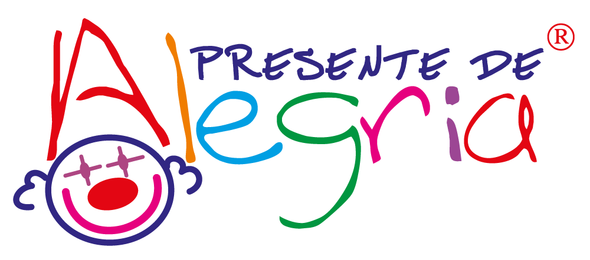

# Presente de Alegria · App

<p align="center"></p>

[](https://github.com/patrickfcf/presentedealegria-app/actions/workflows/ci.yml)
[](LICENSE)


[Começar](#executar) · [Contribuir](CONTRIBUTING.md) · [Segurança](SECURITY.md) · [Publicar](docs/deployment.md) · [Administrar](docs/administration.md)

PWA para relatórios mensais de visita, equipes, notícias e eventos da ONG Presente de Alegria.

**Estado: implementação e testes automatizados concluídos; ativação de produção pendente.**
O banco e as funções foram implantados no Supabase. Faltam conectar Cloudflare Pages, configurar e testar e-mail de acesso, provisionar o primeiro administrador e cadastrar as células oficiais. Não coletar dados reais antes do teste de aceite descrito em `docs/deployment.md`.

## Executar

Node.js 24 e npm:

```sh
git clone https://github.com/patrickfcf/presentedealegria-app.git
cd presentedealegria-app
npm ci
cp .env.example .env.local
# Preencha somente URL e chave PUBLICÁVEL do Supabase.
npm run dev
npm test
npm run lint
npm run build
```

`npm run preview` serve o build de produção, incluindo o service worker. O PWA exige HTTPS em produção. `npm run icons` regenera os ícones a partir do logo oficial.

## O que está incluído

- Entrada por código enviado ao e-mail cadastrado, sem cadastro público.
- Cinco perfis: administrador, diretor, coordenador, voluntário individual e Comunicação e Eventos.
- Hierarquia diretor → coordenador → voluntários; substituição de coordenador com preservação do histórico.
- Uma visita esperada por célula/mês; estrutura permite visitas adicionais sem reescrever o banco.
- Formulário em quatro passos: visita e chamada, profissional e indicadores, comprovação, revisão.
- CPF do profissional da instituição opcional; quantidades desconhecidas distintas de zero e identificação de estimativas.
- Assinatura na tela OU até três PDFs/JPGs/PNGs assinados em papel.
- PDF gerado no servidor, armazenado com os originais em bucket privado; download individual e ZIP mensal.
- Painel de pendências e comparação de células; filtros por mês, célula, coordenador e situação.
- Notícias e eventos publicados pela Comunicação; voluntários têm eventos e calendário.
- Manifest, ícones oficiais, Apple touch icon, service worker, instruções de instalação e QR da URL configurada.

## Arquitetura

React + TypeScript + Vite → Supabase Auth/PostgreSQL/RLS/Storage/Edge Functions.
Cloudflare Pages publica a aplicação estática a partir de `main` no GitHub. Não há servidor extra.

- `src/`: interface e integração com o Supabase.
- `shared/`: validação e geração de PDF compartilhadas com as funções.
- `supabase/migrations/`: esquema, permissões e operações transacionais.
- `supabase/functions/`: envio de relatórios e administração.
- `supabase/tests-security.sql`: testes reais de RLS/hierarquia dentro de transação revertida.
- `tests/`: validação, PDF e fluxo de interface.
- `scripts/build-pwa.mjs`: cache apenas do shell público, nunca de relatórios ou respostas da API.

Leia [implantação](docs/deployment.md), [administração](docs/administration.md), [arquitetura](docs/architecture.md), [segurança](docs/security.md) e [progresso](docs/progress.md).

## Configuração pública e segredos

O frontend recebe somente `VITE_SUPABASE_URL`, `VITE_SUPABASE_PUBLISHABLE_KEY` e `VITE_PRODUCTION_URL`. A chave publicável não substitui RLS. Nunca incluir service role, senha de banco, tokens de CI ou dados pessoais no repositório público. As funções usam segredos fornecidos pelo ambiente do Supabase.

## Perfis e responsabilidades

Todos são voluntários; o perfil cadastrado determina as permissões. A escolha na primeira tela apenas orienta a navegação.

| Perfil | Responsabilidade |
|---|---|
| Administrador | Gerencia acessos, células, equipes, relatórios e publicações |
| Diretor de célula | Gerencia seus coordenadores, consulta voluntários e acompanha relatórios |
| Coordenador de célula | Gerencia sua equipe, registra chamada e envia relatórios |
| Voluntário individual | Consulta eventos e calendário |
| Comunicação e Eventos | Publica notícias e eventos; não acessa documentos das instituições |

Veja os limites completos em [Administração](docs/administration.md). Nome, cargo, CPF e assinatura no relatório pertencem ao **profissional da instituição**; o coordenador é o responsável pelo envio.

## Desenvolvimento assistido por agentes

[AGENTS.md](AGENTS.md) registra as regras de produto, privacidade, validação e atualização de documentação. Há três skills versionadas em `.agents/skills/`, específicas para este projeto:

- `pda-react-pwa`: interface mobile, acessibilidade, instalação e cache público.
- `pda-supabase-reports`: permissões, hierarquia, envio idempotente e PDF privado.
- `pda-cloudflare-release`: build, variáveis públicas, implantação e aceite.

Em agentes com suporte a skills de repositório, invoque pelo nome; nos demais, peça a leitura do `SKILL.md` correspondente. Elas não exigem plugins pagos nem concedem acesso a serviços.

## Contribuições e segurança

Leia [CONTRIBUTING.md](CONTRIBUTING.md) antes de abrir um PR. Para vulnerabilidades, siga [SECURITY.md](SECURITY.md); não publique dados pessoais ou evidências sensíveis em issues. O badge Quality consulta o CI real; não representa certificação de segurança nem aceite de produção.

## Marca e licenças

Logo original da ONG: https://presentedealegria.org.br/wp-content/uploads/2023/09/marca-colorida.png, obtido em 17/09/2026. A marca pertence ao Presente de Alegria; seu uso neste projeto não concede licença de marca a terceiros. Cores de interface extraídas do site oficial: roxo `#6437D1`, roxo escuro `#2D1D54` e laranja `#FE5D37`.

O PDF inclui um subconjunto latino da fonte Noto Sans, SIL OFL 1.1, com licença em `licenses/NotoSans-OFL.txt`. A fonte é usada apenas no servidor; a interface usa fontes do sistema.

O código e a documentação originais são distribuídos sob a [licença MIT](LICENSE). A licença não concede direitos sobre o nome, logotipo ou marcas da ONG. Assets de terceiros preservam suas próprias licenças; veja [THIRD_PARTY_NOTICES.md](THIRD_PARTY_NOTICES.md).
